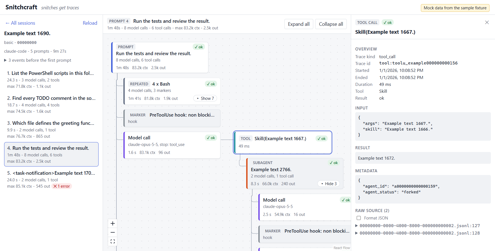

# Snitchcraft

*Snitches get traces.*

A local desktop app that watches Claude Code sessions and draws a diagram of what the agent did for each prompt: model calls, tool calls, results, context growth, and stop reasons.

It is a learning and debugging tool for understanding how an agent harness behaves. The trace format is harness-agnostic, so other harnesses can emit it too.



*The sanitised sample session from `fixtures/`, not a real one.*

## Status

| Milestone | Description | Status |
|---|---|---|
| M1 | Replay a finished session from a file (schema, adapter, CLI tree printer) | Done |
| M2 | Tauri app shell that renders one diagram per prompt | Done |
| M3 | Live file watching: diagrams update as a session runs | Done |
| M4 | Proxy capture of raw API requests: system prompt, tools, messages and the changes between calls | Done |
| M5 | Toy Rust harness that emits the trace format natively | Planned |

## Try it

Print any Claude Code session as a tree. Sessions live in `%USERPROFILE%\.claude\projects\<project>\<session id>.jsonl`.

```powershell
cargo run -p adapter-claude-code --example print_tree -- "$env:USERPROFILE\.claude\projects\<project>\<session id>.jsonl"
```

Output for the sanitised fixture (first lines):

```text
Run: Example text 1690.  [9m27s]
  [hook] SessionStart hook: success
  [hook] SessionStart hook: additional context
  [local_command] Local command: Example text 25.  [0ms]
  Prompt: List the PowerShell scripts in this folder.  [24.3s]
    Model call (claude-opus-5-5) stop=tool_use context=70719 out=462  [4.9s]
      PowerShell(echo example-696) ok  [1.9s]
    Model call (claude-opus-5-5) stop=tool_use context=71302 out=468  [4.9s]
      PowerShell(echo example-1180) ok  [9.0s]
    Model call (claude-opus-5-5) stop=end_turn context=71808 out=219  [3.3s]
    [hook] Stop hooks ran (1)
  Prompt: Find every TODO comment in the source files.  [18.7s]
    Model call (claude-opus-5-5) stop=tool_use context=72081 out=337  [3.9s]
      Grep(Example text 1234.) ok  [98ms]
    Model call (claude-opus-5-5) stop=tool_use context=73075 out=386 2 tools in parallel  [4.1s]
      Grep(Example text 1253.) ok  [84ms]
      Grep(Example text 1263.) ok  [72ms]
    Model call (claude-opus-5-5) stop=tool_use context=73781 out=181  [2.2s]
      Read(C:\work\example\file-1285.txt) ok  [29ms]
    Model call (claude-opus-5-5) stop=end_turn context=74507 out=721  [7.9s]
    [hook] Stop hooks ran (1)
  Prompt: Which file defines the greeting function?  [9.9s]
...
```

Add `--stats` to print only node counts and skipped lines, which is handy for checking that the adapter understands a session without printing its content.

Print the diagram model the UI will draw: one tree per prompt, with parallel groups, collapsed subagents and summaries of repeated calls. Add `--json` for the raw JSON, or `--counts` for counts only.

```powershell
cargo run -p trace-view --example print_diagram -- fixtures\claude-code\basic\00000000-0000-4000-8000-000000000002.jsonl
```

## Layout

- `crates/trace-core`: the trace schema (Run > Turn > ModelCall > ToolCall). No I/O, nothing harness-specific.
- `crates/adapter-claude-code`: converts Claude Code JSONL transcripts into `trace-core` events.
- `crates/trace-view`: turns a trace into the diagram model the UI draws. Harness-agnostic, no I/O. See `docs/VIEW-MODEL.md`.
- `src-tauri/`: the desktop app backend (Tauri 2). Finds and loads sessions, read-only, watches them for changes, and builds the diagram model.
- `ui/`: the web UI shown inside the app window (React, TypeScript, Vite, React Flow).
- `fixtures/`: sanitised example transcripts and an invented capture of the sample session (`fixtures/captures/basic/calls.jsonl`, regenerate with `cargo run -p capture --example make_fixture`), used by tests.
- `docs/`: schema description, diagram view model, design decisions, and notes on harness behaviour.

## Build and run on Windows

Requirements:

- Rust stable with the MSVC toolchain (Visual Studio Build Tools with the C++ workload).
- Microsoft Edge WebView2 runtime (included in Windows 11).
- Node.js 24 or later with npm.
- The Tauri CLI: `cargo install tauri-cli --version "^2" --locked`

In PowerShell, from the repo root:

```powershell
# Once: install the UI packages
cd ui; npm ci; cd ..

# Run the app in development mode (also starts the UI dev server)
cargo tauri dev

# Build a release app and Windows installers into target\release\bundle\
cargo tauri build
```

`cargo tauri build` downloads the WiX and NSIS installer tools from GitHub the first time it runs. The app itself makes no network requests.

### Using the app

1. Pick a session on the left. Sessions are grouped by project, newest first.
2. Pick a prompt. Its diagram opens in the middle: the prompt at the top, its model calls below in order, and each model call's tool calls to its right.
3. Click any box to see its full content on the right: prompt and output text, tool input and result, token usage, stop reason, metadata and the raw transcript lines.

Boxes marked "Repeated" (runs of similar calls) and "Subagent" start collapsed; use their Show button, or "Expand all". A dashed box around tool calls means they were requested together. Status is shown by colour and by a word (ok, error, running).

### Live updates

Sessions written in the last 10 minutes have a green dot in the list. The open session updates by itself while Claude Code writes it: new prompts, model calls, tool results and subagents appear without reloading, and new prompts are highlighted briefly. Expanded boxes and the selected box stay as they are. The session list also refreshes by itself when sessions are added or change.

The app watches the `.claude\projects` folder for changes and also checks the open session once a second, read-only. If the folder cannot be watched, the open session still updates, and the session list needs the Refresh button.

### Capturing a session's raw API calls

Snitchcraft runs a small proxy on `127.0.0.1:47821` while it is open. To capture a session, start Claude Code from PowerShell with the command shown at the top of the session list:

```powershell
$env:ANTHROPIC_BASE_URL='http://127.0.0.1:47821'; claude
```

Only sessions started this way are captured; all other sessions are untouched. The proxy passes every request on to `https://api.anthropic.com` unchanged and streams the answer back, then saves a copy. It works with a Claude subscription login or an API key. If Snitchcraft is closed, a session started this way cannot reach the API, so start it normally then.

Captured model call boxes get an "API" tag. Click one to see the changes since the previous call of the same agent (messages added or removed, tools or settings changed) and the full raw request: system prompt, tool definitions, messages and the response. The session panel's "API calls" section lists the system prompt and tool set versions, any API calls the transcript does not record, the size on disk, and a Delete button.

Captures are stored compressed in `%APPDATA%\dev.snitchcraft.app\captures\`, one folder per session, and are kept until you delete them. They contain everything sent to the model, so treat them like the transcripts. Credential headers (authorization, API keys, cookies, tokens) are never saved, logged or shown.

### Viewing the UI in a browser (development only)

To check the UI without the desktop app, run the UI dev server and open it with `?mock`. It replays the sanitised sample session from `fixtures/`, never your own sessions.

```powershell
cd ui; npm run dev
# then open http://localhost:5173/?mock
```

Add `&delay=2000` to slow responses down, or `&fail=list`, `&fail=load`, `&fail=detail` or `&fail=captures` to see how errors are shown. The sample session includes invented captured API calls. Add `&live` to replay the sample session growing step by step (`&step=<ms>` sets the pace, `&fail=live` ends with the file deleted). Mock mode is not included in production builds.

## Test and lint

```powershell
cargo test --workspace
cargo clippy --workspace --all-targets -- -D warnings
cargo fmt --all
cd ui; npm run lint; npm run typecheck; npm test; npm run build; cd ..
```

## Privacy

The app is read-only and never modifies anything under `.claude`. It can only read session files under `%USERPROFILE%\.claude\projects\`. The only folder it writes to is its own captures folder. Its only network access is the capture proxy: it listens on `127.0.0.1` only (refusing requests from web pages) and forwards only to `https://api.anthropic.com`. The window itself has no file system, shell or network plugins and can only call the app's own commands. Real transcripts can contain secrets and are never committed. Only sanitised fixtures live in this repo.

## Licence

MIT. See `LICENSE`.
